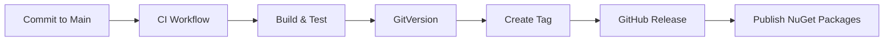

# TinyBDD CI/CD Quick Reference

## Automated Release Workflow



## 🔄 Development Workflow

### 1️⃣ Create Feature Branch

```bash
git checkout -b feature/my-feature
```

### 2️⃣ Make Changes

```bash
# Write code, add tests
git add .
git commit -m "feat: add my feature"
```

### 3️⃣ Push and Create PR

```bash
git push origin feature/my-feature
# Create PR on GitHub
# Wait for validation to complete
```

### 4️⃣ Merge to Main

```bash
# Use "Squash and Merge" or regular merge
# CI will automatically:
# - Build and test
# - Create version tag
# - Publish packages to NuGet
```

## What Happens When?

### On Pull Request

```
PR Created/Updated
 → PR Validation Workflow
 → Build solution
 → Run tests
 → Check generated files
 → Dry-run package creation
 → Post summary
 → Upload dry-run artifacts
```

### On Merge to Main

```
Merge to Main
 → CI Workflow
 → Build & test
 → Check generated files
 → Calculate version (GitVersion)
 → Create packages
 → Create GitHub tag
 → Create GitHub Release
 → Publish to NuGet.org
 → Publish to GitHub Packages
```

## 📦 Version Format

- **Format**: `v{Major}.{Minor}.{Patch}[-{PreRelease}]`
- **Examples**:
  - `v0.1.0` - Initial release
  - `v0.2.0` - Feature added
  - `v0.2.1` - Bug fixed
  - `v1.0.0` - Breaking change
  - `v1.0.0-alpha.1` - Pre-release

Version is automatically calculated by GitVersion based on:
- Git history
- Tags
- Branch name
- Configuration in `GitVersion.yml`

## 📦 What Gets Published?

### NuGet Packages

- **TinyBDD** - Core library
- **TinyBDD.MSTest** - MSTest integration
- **TinyBDD.Xunit** - xUnit integration
- **TinyBDD.Xunit.v3** - xUnit v3 integration
- **TinyBDD.NUnit** - NUnit integration
- **TinyBDD.Extensions.DependencyInjection** - DI extension
- **TinyBDD.Extensions.Hosting** - Hosting extension
- **TinyBDD.Extensions.Reporting** - Reporting extension
- **TinyBDD.SourceGenerators** - Source generators

All packages are published to:
- **NuGet.org** (public)
- **GitHub Packages** (backup)

## ⚠️ Important Notes

### DO

- Write tests for new features
- Run `dotnet script src/TinyBDD/build/GenerateOverloads.csx --no-cache` after modifying overload generation
- Let PR validation complete before merging
- Review dry-run artifacts in PRs
- Follow existing code style

### DON'T

- Manually edit generated files in `src/TinyBDD/Generated/`
- Force-push to main branch
- Merge PRs with failing checks
- Skip tests

## 🔧 Common Commands

### Build

```bash
dotnet build TinyBDD.sln --configuration Release
```

### Test

```bash
dotnet test TinyBDD.sln --configuration Release
```

### Run Benchmarks

```bash
cd benchmarks/TinyBDD.Benchmarks
dotnet run -c Release
```

### Generate Overloads

```bash
dotnet script src/TinyBDD/build/GenerateOverloads.csx --no-cache
```

### Pack Locally

```bash
dotnet pack TinyBDD.sln --configuration Release --output ./packages
```

## 📋 Workflows

### Active Workflows

- **CI** (`.github/workflows/ci.yml`)
  - Runs on: Push to main, Pull requests
  - Actions: Build, test, pack, publish

- **Docs** (`.github/workflows/docs.yml`)
  - Runs on: Push to main
  - Actions: Build and publish documentation

- **CodeQL** (`.github/workflows/codeql-analysis.yml`)
  - Runs on: Schedule, Push to main, Pull requests
  - Actions: Security analysis

- **Dependency Review** (`.github/workflows/dependency-review.yml`)
  - Runs on: Pull requests
  - Actions: Check for vulnerable dependencies

- **Labeler** (`.github/workflows/labeler.yml`)
  - Runs on: Pull requests, Issues
  - Actions: Auto-label based on changed files

- **PR Validation** (`.github/workflows/pr-validation.yml`)
  - Runs on: Pull requests
  - Actions: Extended validation and dry-run packaging

- **Stale** (`.github/workflows/stale.yml`)
  - Runs on: Schedule (daily)
  - Actions: Mark and close stale issues/PRs

- **Update Packages** (`.github/workflows/update-packages.yml`)
  - Runs on: Schedule (weekly)
  - Actions: Check for package updates and create PR

## Troubleshooting

### Generated Files Out of Date

**Problem**: PR check fails with "Generated files out of date"

**Fix**:
```bash
dotnet script src/TinyBDD/build/GenerateOverloads.csx --no-cache
git add src/TinyBDD/Generated/
git commit -m "chore: update generated files"
```

### Build Failing

**Problem**: CI workflow fails

**Check**:
1. Review CI logs in Actions tab
2. Run tests locally: `dotnet test`
3. Check for dependency issues
4. Ensure .NET 8/9/10 SDKs are installed

### Package Not Published

**Problem**: Merged to main but package not published

**Check**:
1. Did CI workflow complete successfully?
2. Check if NuGet API key is set (secrets.NUGET_API_KEY)
3. Review release job logs

## More Information

- **Full Workflow Documentation**: [.github/workflows/](../.github/workflows/)
- **Contributing Guide**: [README.md](../README.md)
- **GitVersion Documentation**: https://gitversion.net/
- **Issues**: https://github.com/JerrettDavis/TinyBDD/issues

## Learning Path

1. Read the [README.md](../README.md)
2. Review existing PRs for examples
3. Check the [docs](../docs/) folder
4. Look at the test projects for usage examples
5. Run benchmarks to understand performance characteristics
